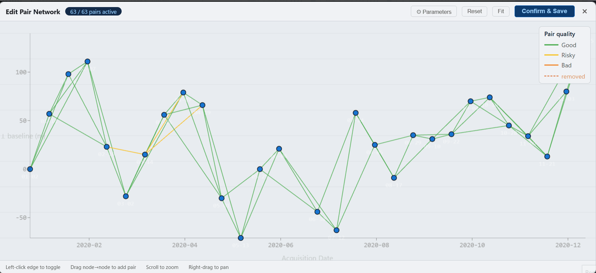

# InSARHub

InSARHub is a modular Python framework for automated InSAR and time-series processing.

The primary goal of this package is to provide a streamlined and user-friendly InSAR processing experience across multiple satellite products. InSARHub currently supports: 

| Satellite | Mode | Download | IFG Generation | Timeseries Analysis |
|-----------|------|----------|----------------|---------------------|
| Sentinel-1 SLC | Mixed¹ / Local / HPC | ✅ | ✅ | ✅ |

> ¹ **Mixed** — process pipeline that mixed with cloud processing and local processing

## Table of Contents
- [Web UI](#web-ui)
- [Installation](#installation)
- [Requirements](#requirements)
- [Usage](#usage)
- [CLI](#cli)
- [Documentation](#documentation)

## Web UI

InSARHub includes a **self-hosted web interface** that covers the full InSAR workflow — from scene search and download through interferogram processing to time-series analysis.
```bash
insarhub-app
```

Open `http://localhost:8080` to access the UI.

All data stays on your machine — InSARHub runs a local FastAPI server and delivers a modern React frontend directly in your browser.

See the [Web UI documentation](https://jldz9.github.io/InSARHub/) for a full walkthrough.

### Search & Download

Draw an AOI on the interactive map, set a date range and orbit filters, and search ASF for Sentinel-1 SLC stacks. InSARHub groups results by track/frame and downloads scenes and precise orbit files automatically.

<picture>
  <source media="(prefers-color-scheme: dark)"  srcset="docs/frontend/fig/overview_dark.png">
  <source media="(prefers-color-scheme: light)" srcset="docs/frontend/fig/overview_light.png">
  
</picture>

### Pair Selection & Quality Scoring

Build the interferogram network interactively. Pairs are colored by score so weak connections stand out immediately. Adjust temporal or perpendicular baseline limits and drag nodes/edges to refine the network live.

<picture>
  <source media="(prefers-color-scheme: dark)"  srcset="docs/frontend/fig/network_modify_dark.gif">
  <source media="(prefers-color-scheme: light)" srcset="docs/frontend/fig/network_modify_light.gif">
  
</picture>

### Processor

Submit the selected pairs to HyP3 (cloud, no local SAR software needed) or run ISCE2 `stackSentinel` locally or via SLURM. Monitor job status, download results, and retry failed jobs from the same panel.

### Analyzer

Run MintPy SBAS time-series analysis step by step. Edit the network post-ingest, inspect diagnostic overview layers, and export velocity and displacement maps when done.

### Results Viewer

Overlay the LOS velocity map on the basemap and click any pixel to plot its full displacement time series.

<picture>
  <source media="(prefers-color-scheme: dark)"  srcset="docs/frontend/fig/timeseries_dark.png">
  <source media="(prefers-color-scheme: light)" srcset="docs/frontend/fig/timeseries_light.png">
  
</picture>

---

## Installation

InSARHub can be installed using Conda:
```bash
conda install insarhub -c conda-forge
```
Pip:

```bash
conda install gdal -c conda-forge
pip install insarhub
```

From source:

```bash
git clone https://github.com/jldz9/InSARHub.git
cd InSARHub
conda env create -f environment.yml -n insarhub_dev
conda activate insarhub_dev
**Note:
Run this command from the repository root directory after activating the Conda environment.
The trailing "." is required because pip installs the current project in editable mode.**
pip install -e .
```

**ISCE2 local processing** requires a separate ISCE2 environment. Use the provided environment file:

```bash
conda env create -f environment-isce2.yml -n insarhub_isce2
conda activate insarhub_isce2
pip install -e .
```

> ISCE2 must be installed and activated in the same environment. See the [ISCE2 installation guide](https://github.com/isce-framework/isce2) for details.

## Requirements
- Python >=3.11,<3.13
- numpy <2.0
- proj >=9.4
- gdal >=3.8
- sqlite >=3.44
- mintpy
- asf_search 
- colorama 
- contextily 
- dem_stitcher 
- hyp3_sdk 
- rasterio >=1.4
- sentineleof
- pyproj
- fastapi
- uvicorn
- python-multipart

## Usage 

### Downloader:

```python
from insarhub import Downloader
```

- View available downloaders

    ```python
    Downloader.available()
    ```
- Create downloader

    ```python
    dl = Downloader.create('S1_SLC',
                            intersectsWith=[-113.05, 37.74, -112.68, 38.00],
                            start='2020-01-01',
                            end='2020-12-31',
                            relativeOrbit=100,
                            frame=466,
                            workdir='path/to/dir')
    ```

- Search
    ```python
    results = dl.search()
    ```

- Filter
    ```python
    filter_result = dl.filter(start='2020-02-01')
    ```

- Select interferogram pairs
    ```python
    from insarhub.utils import plot_pair_network
    pairs, baselines, scene_bperp = dl.select_pairs(dt_max=96, pb_max=150)
    fig = plot_pair_network(pairs, baselines, scene_bperp)
    fig.show()
    ```

- Download

    ```python
    dl.download()
    ```

### Processor:

```python
from insarhub import Processor
```
- View available processors
    ```python
    Processor.available()
    ```

Two processors are available:

#### HyP3 (cloud)

```python
processor = Processor.create('Hyp3_S1', workdir='/your/work/path', pairs=pairs)
jobs = processor.submit()
jobs = processor.refresh()
processor.download()
```

#### ISCE2 (local / HPC)

Requires SLC `.SAFE` files already downloaded. Runs ISCE2 `stackSentinel` locally or submits each step to SLURM with `hpc_mode=True`.

```python
from insarhub.config import ISCE_S1_Config

cfg = ISCE_S1_Config(
    workdir='/data/p100_f466',
    bbox=[33.0, 38.0, -120.0, -115.0],   # [S, N, W, E]
)
processor = Processor.create('ISCE_S1', pairs=pairs, config=cfg)
processor.submit()        # starts background execution
processor.refresh()       # check step status
```


### Analyzer

```python
from insarhub import Analyzer
```
- View available analyzers
    ```python
    Analyzer.available()
    ```

Two analyzers are available, matched to the processor that generated the interferograms:

#### HyP3 outputs

```python
analyzer = Analyzer.create('Hyp3_SBAS', workdir="/your/work/dir")
analyzer.prep_data()   # unzip and clip HyP3 products
analyzer.run()         # full MintPy SBAS pipeline
```

#### ISCE2 outputs

```python
analyzer = Analyzer.create('ISCE_SBAS', workdir="/your/work/dir")
analyzer.prep_data()   # auto-discover ISCE2 interferograms and geometry
analyzer.run()         # full MintPy SBAS pipeline
```

## CLI

InSARHub includes a command-line interface for running the full pipeline without writing Python code, suitable for HPC batch jobs and scripted workflows.

```bash
insarhub <command> [options]
```

### End-to-end example — HyP3 (cloud)

```bash
# Search scenes and select interferogram pairs
insarhub downloader -N S1_SLC \
    --AOI -113.05 37.74 -112.68 38.00 \
    --start 2020-01-01 --end 2020-12-31 \
    --stacks 100:466 \
    -w /data/bryce \
    --select-pairs

# Submit pairs to HyP3 (auto-reads stack_p*_f*.json from workdir subfolders)
insarhub processor -N Hyp3_S1 -w /data/bryce submit

# Wait for jobs and download results automatically
insarhub processor -w /data/bryce watch

# Run MintPy time-series analysis
insarhub analyzer -N Hyp3_SBAS -w /data/bryce run
```

### End-to-end example — ISCE2 (local / HPC)

```bash
# Search and download SLC scenes + orbits
insarhub downloader -N S1_SLC \
    --AOI -113.05 37.74 -112.68 38.00 \
    --start 2020-01-01 --end 2020-12-31 \
    --stacks 100:466 \
    -w /data/p100_f466 \
    --select-pairs --download --orbits

# Dry run to verify ISCE2 config before committing
insarhub processor -N ISCE_S1 -w /data/p100_f466 \
    --bbox 33.0 38.0 -120.0 -115.0 submit --dry-run

# Run ISCE2 stackSentinel locally (background) or on SLURM (--hpc_mode True)
insarhub processor -N ISCE_S1 -w /data/p100_f466 \
    --bbox 33.0 38.0 -120.0 -115.0 submit

# Monitor step progress
insarhub processor -N ISCE_S1 -w /data/p100_f466 refresh

# Run MintPy time-series analysis on ISCE2 outputs
insarhub analyzer -N ISCE_SBAS -w /data/p100_f466 run
```

### Commands

| Command | Description |
|---------|-------------|
| `insarhub downloader` | Search scenes, select interferogram pairs, and download data |
| `insarhub processor`  | Submit and manage InSAR processing jobs |
| `insarhub analyzer`   | Run time-series analysis on processed interferograms |
| `insarhub utils`      | Helper utilities (pair selection, network plot, SLURM, ERA5, clip) |

Use `insarhub <command> --help` for full option details, or see the [CLI Reference](https://jldz9.github.io/InSARHub/quickstart/cli/).

## Documentation

[InSARHub documentation](https://jldz9.github.io/InSARHub/)

