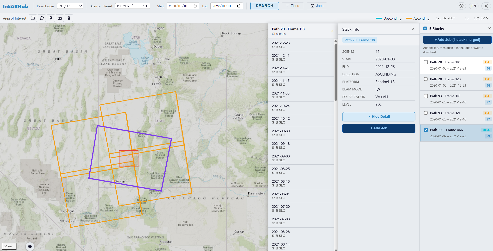
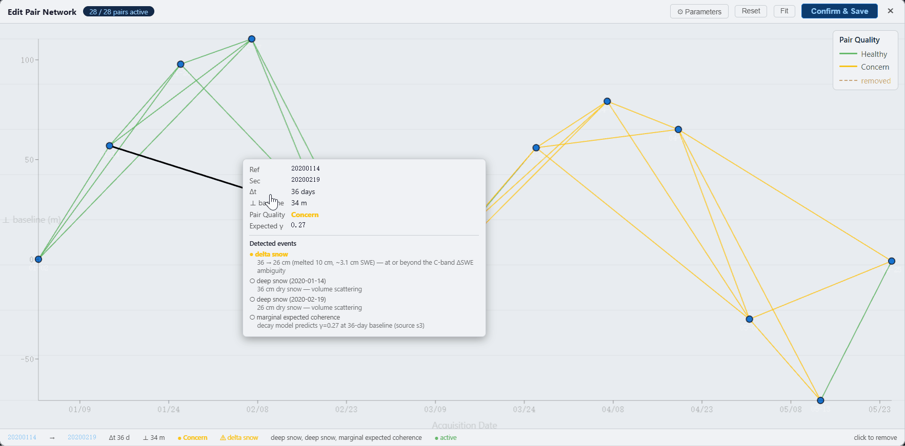

<p align="center">
  <picture>
    <source media="(prefers-color-scheme: dark)"  srcset="docs/logo-light.png">
    <source media="(prefers-color-scheme: light)" srcset="docs/logo-dark.png">
    
  </picture>
</p>

<p align="center">
  <a href="README.md">English</a> | <b>简体中文</b>
</p>

<p align="center">
  <a href="https://pypi.org/project/insarhub/"></a>
  <a href="https://anaconda.org/conda-forge/insarhub"></a>
  
  <a href="https://github.com/jldz9/InSARHub/blob/main/LICENSE"></a>
  <a href="https://jldz9.github.io/InSARHub/"></a>
</p>

<p align="center">
  
  
  
  
  
</p>

InSARHub 是一个模块化的 Python 框架，用于自动化 InSAR 与时序处理。

本项目的主要目标是在多种卫星产品上提供流畅、易用的 InSAR 处理体验。InSARHub 目前支持：

| 卫星 | 产品 | 运行模式 | 下载 | 干涉图生成 | 时序分析 |
|-----------|---------|------|----------|----------------|---------------------|
| Sentinel-1 | SLC | 混合¹ / 本地 / HPC / Docker | ✅ | ✅ | ✅ |
| Sentinel-1 | Burst | 本地 / HPC / Docker | ✅ | ✅ | ✅ |
| NISAR | GSLC | 本地 / HPC / Docker | ✅ | ✅ | ✅ |

> ¹ **混合** —— 将云端处理与本地处理相结合的处理流程

## 目录
- [Web UI](#web-ui)
- [安装](#安装)
- [依赖](#依赖)
- [使用](#使用)
- [命令行（CLI）](#命令行cli)
- [文档](#文档)

## Web UI

InSARHub 内置一个**自托管的 Web 界面**，覆盖完整的 InSAR 工作流 —— 从场景检索与下载，到干涉图处理，再到时序分析。
```bash
insarhub-app
```

打开 `http://localhost:8080` 即可访问界面。

所有数据都保留在本机 —— InSARHub 在本地运行一个 FastAPI 服务，并直接在浏览器中提供现代化的 React 前端。

完整演练请参阅 [Web UI 文档](https://jldz9.github.io/InSARHub/)。

### 检索与下载

在交互式地图上绘制 AOI，设置日期范围与轨道过滤条件，然后在 ASF 上检索 Sentinel-1 SLC 影像栈。InSARHub 按 track/frame 对结果分组，并自动下载场景与精密轨道文件。

<picture>
  <source media="(prefers-color-scheme: dark)"  srcset="docs/frontend/fig/search_dark.gif">
  <source media="(prefers-color-scheme: light)" srcset="docs/frontend/fig/search_light.gif">
  
</picture>

### 像对选择与质量评分

交互式地构建干涉图网络。像对按评分着色，弱连接一目了然。可调整时间基线或垂直基线上限，并实时拖动节点/边来优化网络。

<picture>
  <source media="(prefers-color-scheme: dark)"  srcset="docs/frontend/fig/network_modify_dark.gif">
  <source media="(prefers-color-scheme: light)" srcset="docs/frontend/fig/network_modify_light.gif">
  
</picture>

### 处理器（Processor）

将选定的像对提交给云端或本地 InSAR 引擎，在本地、SLURM 或 Docker 中运行，监控任务状态、下载结果，并在同一面板中重试失败的任务。

| 处理器 | 卫星 / 产品 | 引擎 | 运行方式 | 输出 |
|-----------|--------------------|--------|-----------|--------|
| `Hyp3_S1` | Sentinel-1 SLC | HyP3（GAMMA，云端） | 云端 | 地理编码干涉图 |
| `ISCE2_S1` | Sentinel-1 SLC | ISCE2 `stackSentinel` | 本地 / HPC / Docker | 配准影像栈 + 干涉图 |
| `GMTSAR_S1` | Sentinel-1 SLC | GMTSAR（`p2p_processing`） | 本地 / HPC / Docker | 地理编码干涉图 + 影像栈 |
| `ISCE3_Burst` | Sentinel-1 Burst | ISCE3 + COMPASS | 本地 / HPC / Docker | 地理编码 burst SLC + 干涉图 |
| `ISCE3_NISAR` | NISAR GSLC | ISCE3 + dolphin | 本地 / HPC / Docker | 相位链接干涉图 |

### 分析器（Analyzer）

逐步运行时序分析。可在数据导入后编辑网络、查看诊断概览图层，并在完成后导出速度场与形变图。每个分析器都与生成干涉图的处理器相匹配。

| 分析器 | 兼容的处理器 | 方法 | 输出 |
|----------|---------------------|--------|--------|
| `Hyp3_Mintpy_SBAS` | `Hyp3_S1` | MintPy SBAS | 速度场 + 形变时序 |
| `ISCE2_Mintpy_SBAS` | `ISCE2_S1` | MintPy SBAS | 速度场 + 形变时序 |
| `GMTSAR_Mintpy_SBAS` | `GMTSAR_S1` | MintPy SBAS（`prep_gmtsar.py`） | 速度场 + 形变时序 |
| `GMTSAR_SBAS` | `GMTSAR_S1` | GMTSAR 原生 SBAS（`sbas` 二进制，无需 MintPy） | `disp_*.grd` + `vel.grd` |
| `ISCE3_Dolphin_PL` | `ISCE3_Burst`、`ISCE3_NISAR` | dolphin 相位链接 | 累积形变、速度场、残差 |

### 结果查看器

将视线向（LOS）速度场叠加到底图上，点击任意像元即可绘制其完整的形变时序。

<picture>
  <source media="(prefers-color-scheme: dark)"  srcset="docs/frontend/fig/timeseries_dark.png">
  <source media="(prefers-color-scheme: light)" srcset="docs/frontend/fig/timeseries_light.png">
  
</picture>

---

## 安装

使用 Conda 安装：
```bash
conda install insarhub -c conda-forge
```
使用 Pip：

```bash
conda install gdal -c conda-forge
pip install insarhub
```

从源码安装：

```bash
git clone https://github.com/jldz9/InSARHub.git
cd InSARHub
conda env create -f environment.yml -n insarhub_dev
conda activate insarhub_dev
pip install -e .
```

以上命令安装的是基础版 InSARHub（HyP3 + MintPy）。使用 **ISCE2**、**ISCE3 + dolphin** 或 **GMTSAR** 进行本地处理时，需要各自的工具链额外安装到该环境中。各处理器的具体安装步骤请参阅[安装指南](https://jldz9.github.io/InSARHub/quickstart/install/)。

### 在容器中运行

无需在本地安装繁重的 SAR 工具链，可直接在 Docker 中运行各个处理器/分析器。先安装基础版 InSARHub（上面的 Conda/pip），然后在任意处理器或分析器命令后加上 `--container` —— InSARHub 会拉取对应镜像并在其中运行该步骤，同时自动挂载你的工作目录：

```bash
insarhub processor -N ISCE2_S1 -w /data/p100_f466 --bbox 33.0 38.0 -120.0 -115.0 submit --container
```

预构建镜像（`ghcr.io/jldz9/insarhub-*:dev`）：

| 镜像 | 覆盖范围 |
|-------|--------|
| `insarhub-base` | `Hyp3_S1` + `Hyp3_Mintpy_SBAS`（通过 HyP3 处理 Sentinel-1） |
| `insarhub-isce2-mintpy` | `ISCE2_S1` + `ISCE2_Mintpy_SBAS` |
| `insarhub-gmtsar-mintpy` | `GMTSAR_S1` + GMTSAR 分析器 |
| `insarhub-isce3-dolphin` | `ISCE3_Burst`、`ISCE3_NISAR` + `ISCE3_Dolphin_PL` |

你也可以完全在容器中运行，而无需在本地安装任何东西。详情请参阅[容器运行指南](https://jldz9.github.io/InSARHub/advanced/container/)，若需自行构建镜像，请查看 [`docker/`](docker/) 下的 Dockerfile。

## 依赖
- Python >=3.11,<3.13
- numpy <2.0
- proj >=9.4
- gdal >=3.8
- sqlite >=3.44
- mintpy
- asf_search
- colorama
- contextily
- dem_stitcher
- hyp3_sdk
- rasterio >=1.4
- sentineleof
- pyproj
- fastapi
- uvicorn
- python-multipart

## 使用

### 下载器（Downloader）：

```python
from insarhub import Downloader
```

- 查看可用的下载器

    ```python
    Downloader.available()
    ```
- 创建下载器

    ```python
    dl = Downloader.create('S1_SLC',
                            intersectsWith=[-113.05, 37.74, -112.68, 38.00],
                            start='2020-01-01',
                            end='2020-12-31',
                            relativeOrbit=100,
                            frame=466,
                            workdir='path/to/dir')
    ```

- 检索
    ```python
    results = dl.search()
    ```

- 过滤
    ```python
    filter_result = dl.filter(start='2020-02-01')
    ```

- 选择干涉图像对
    ```python
    from insarhub.utils import plot_pair_network
    pairs, baselines, scene_bperp = dl.select_pairs(dt_max=96, pb_max=150)
    fig = plot_pair_network(pairs, baselines, scene_bperp)
    fig.show()
    ```

- 下载

    ```python
    dl.download()
    ```

### 处理器（Processor）：

```python
from insarhub import Processor
```
- 查看可用的处理器
    ```python
    Processor.available()
    ```

完整列表见上方的[处理器表格](#处理器processor)。以下是两种引擎的示例工作流：

#### HyP3（云端）

```python
processor = Processor.create('Hyp3_S1', workdir='/your/work/path', pairs=pairs)
jobs = processor.submit()
jobs = processor.refresh()
processor.download()
```

#### ISCE2（本地 / HPC）

需要已下载的 SLC `.SAFE` 文件。在本地运行 ISCE2 `stackSentinel`，或在 `hpc_mode=True` 时将每个步骤提交到 SLURM。

```python
from insarhub.config import ISCE2_S1_Config

cfg = ISCE2_S1_Config(
    workdir='/data/p100_f466',
    bbox=[33.0, 38.0, -120.0, -115.0],   # [S, N, W, E]
)
processor = Processor.create('ISCE2_S1', pairs=pairs, config=cfg)
processor.submit()        # 启动后台运行
processor.refresh()       # 查看步骤状态
```


### 分析器（Analyzer）

```python
from insarhub import Analyzer
```
- 查看可用的分析器
    ```python
    Analyzer.available()
    ```

完整列表见上方的[分析器表格](#分析器analyzer)。以下是示例工作流：

#### HyP3 输出

```python
analyzer = Analyzer.create('Hyp3_Mintpy_SBAS', workdir="/your/work/dir")
analyzer.prep_data()   # 解压并裁剪 HyP3 产品
analyzer.run()         # 完整的 MintPy SBAS 流程
```

#### ISCE2 输出

```python
analyzer = Analyzer.create('ISCE2_Mintpy_SBAS', workdir="/your/work/dir")
analyzer.prep_data()   # 自动发现 ISCE2 干涉图与几何数据
analyzer.run()         # 完整的 MintPy SBAS 流程
```

## 命令行（CLI）

InSARHub 提供命令行界面，无需编写 Python 代码即可运行完整流程，适合 HPC 批处理任务与脚本化工作流。

```bash
insarhub <command> [options]
```

### 端到端示例 —— HyP3（云端）

```bash
# 检索场景并选择干涉图像对
insarhub downloader -N S1_SLC \
    --AOI -113.05 37.74 -112.68 38.00 \
    --start 2020-01-01 --end 2020-12-31 \
    --stacks 100:466 \
    -w /data/bryce \
    --select-pairs

# 将像对提交给 HyP3（自动读取工作目录子文件夹中的 stack_p*_f*.json）
insarhub processor -N Hyp3_S1 -w /data/bryce submit

# 等待任务完成并自动下载结果
insarhub processor -w /data/bryce watch

# 运行 MintPy 时序分析
insarhub analyzer -N Hyp3_Mintpy_SBAS -w /data/bryce run
```

### 端到端示例 —— ISCE2（本地 / HPC）

```bash
# 检索并下载 SLC 场景 + 轨道文件
insarhub downloader -N S1_SLC \
    --AOI -113.05 37.74 -112.68 38.00 \
    --start 2020-01-01 --end 2020-12-31 \
    --stacks 100:466 \
    -w /data/p100_f466 \
    --select-pairs --download --orbits

# 试运行以在正式提交前检查 ISCE2 配置
insarhub processor -N ISCE2_S1 -w /data/p100_f466 \
    --bbox 33.0 38.0 -120.0 -115.0 submit --dry-run

# 在本地（后台）或 SLURM（--hpc_mode True）上运行 ISCE2 stackSentinel
insarhub processor -N ISCE2_S1 -w /data/p100_f466 \
    --bbox 33.0 38.0 -120.0 -115.0 submit

# 监控步骤进度
insarhub processor -N ISCE2_S1 -w /data/p100_f466 refresh

# 对 ISCE2 输出运行 MintPy 时序分析
insarhub analyzer -N ISCE2_Mintpy_SBAS -w /data/p100_f466 run
```

### 命令

| 命令 | 说明 |
|---------|-------------|
| `insarhub downloader` | 检索场景、选择干涉图像对并下载数据 |
| `insarhub processor`  | 提交并管理 InSAR 处理任务 |
| `insarhub analyzer`   | 对已处理的干涉图运行时序分析 |
| `insarhub utils`      | 辅助工具（像对选择、网络绘图、SLURM、ERA5、裁剪） |

使用 `insarhub <command> --help` 查看完整选项说明，或参阅 [CLI 参考](https://jldz9.github.io/InSARHub/quickstart/cli/)。

## 文档

[InSARHub 文档](https://jldz9.github.io/InSARHub/)
