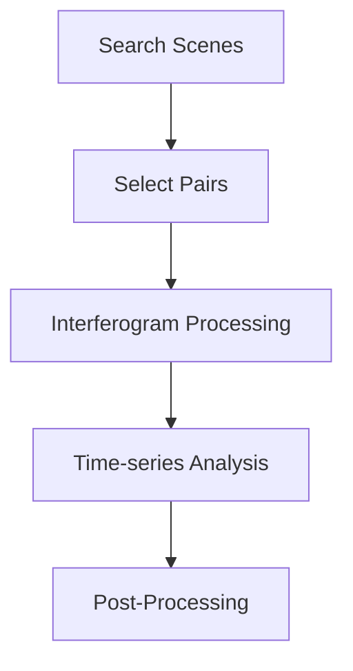

The InSARHub CLI (`insarhub`) drives the whole pipeline — search, process, analyze — from a single command. This page shows the **end-to-end workflow**: which commands to run, and in what order. For every subcommand and flag, see the [CLI Reference](../advanced/cli_reference.md), or run `--help` on any command.

```bash
insarhub <command> [options]
insarhub --help
insarhub downloader --help
```

## Workflow

<div style="text-align: center;">

</div>

Every run is the same four stages — **search & select → process → analyze → post-process** — and differs only in which processor/analyzer backend does the work. Each command writes an `insarhub_config.json` to the workdir and reloads it on later runs, so after the first call you only pass what changed.

## HyP3

Cloud processing — no local tools needed; interferograms are generated by ASF HyP3.

```bash
# 1. Search and select pairs
insarhub downloader -N S1_SLC \
    --AOI -113.05 37.74 -112.68 38.00 \
    --start 2020-01-01 --end 2020-12-31 --stacks 100:466 \
    -w /data/bryce --select-pairs

# 2. Submit interferograms to HyP3
insarhub processor -N Hyp3_S1 -w /data/bryce submit 

# 3. Check job status (re-run until all SUCCEEDED)
insarhub processor -N Hyp3_S1 -w /data/bryce refresh 

# 4. Download completed outputs
insarhub processor -N Hyp3_S1 -w /data/bryce download 

# 5. Time-series analysis
insarhub analyzer -N Hyp3_Mintpy_SBAS -w /data/bryce run

```

## ISCE2_S1

Requires a local ISCE2 install (or `--container`). SLC `.SAFE` files are downloaded first.

```bash
# Search and download SLC scenes + orbits
insarhub downloader -N S1_SLC \
    --AOI -113.05 37.74 -112.68 38.00 \
    --start 2020-01-01 --end 2020-12-31 --stacks 100:466 \
    -w /data/p100_f466 --select-pairs --download -O
```

Process the stack, then run the time-series (add `--dry-run` to the submit to check paths first):

=== "Local"

    ```bash
    insarhub processor -N ISCE2_S1 -w /data/p100_f466 submit   
    insarhub processor -N ISCE2_S1 -w /data/p100_f466 refresh  
    insarhub analyzer  -N ISCE2_Mintpy_SBAS -w /data/p100_f466 run
    ```

=== "Local (container)"

    ```bash
    insarhub processor -N ISCE2_S1 -w /data/p100_f466  submit  --container
    insarhub processor -N ISCE2_S1 -w /data/p100_f466 refresh  --container
    insarhub analyzer  -N ISCE2_Mintpy_SBAS -w /data/p100_f466 run --container
    ```

=== "HPC (SLURM)"

    ```bash
    insarhub processor -N ISCE2_S1 -w /data/p100_f466 submit  --hpc_mode
    insarhub processor -N ISCE2_S1 -w /data/p100_f466 refresh 
    insarhub analyzer  -N ISCE2_Mintpy_SBAS -w /data/p100_f466 run --hpc_mode
    ```

```bash
# Export velocity to GeoTIFF
insarhub utils h5-to-raster -i /data/p100_f466/mintpy/geo/geo_velocity.h5
```

## GMTSAR_S1

Requires a local GMTSAR install (or `--container`). SLC `.SAFE` files are downloaded first; the DEM is auto-downloaded from the footprint.

```bash
# Search and download SLC scenes + orbits
insarhub downloader -N S1_SLC \
    --AOI -113.05 37.74 -112.68 38.00 \
    --start 2020-01-01 --end 2020-12-31 --stacks 100:466 \
    -w /data/gmtsar --select-pairs --download -O
```

Generate interferograms, then run the MintPy time-series:

=== "Local"

    ```bash
    insarhub processor -N GMTSAR_S1 -w /data/gmtsar submit  
    insarhub processor -N GMTSAR_S1 -w /data/gmtsar refresh 
    insarhub analyzer  -N GMTSAR_Mintpy_SBAS -w /data/gmtsar run
    ```

=== "Local (container)"

    ```bash
    insarhub processor -N GMTSAR_S1 -w /data/gmtsar  submit  --container
    insarhub processor -N GMTSAR_S1 -w /data/gmtsar  refresh --container
    insarhub analyzer  -N GMTSAR_Mintpy_SBAS -w /data/gmtsar run --container
    ```

=== "HPC (SLURM)"

    ```bash
    insarhub processor -N GMTSAR_S1 -w /data/gmtsar submit   --hpc_mode
    insarhub processor -N GMTSAR_S1 -w /data/gmtsar refresh 
    insarhub analyzer  -N GMTSAR_Mintpy_SBAS -w /data/gmtsar run --hpc_mode
    ```

```bash
# Export velocity to GeoTIFF (GMTSAR output is already geocoded)
insarhub utils h5-to-raster -i /data/gmtsar/gmtsar_mintpy/velocity.h5
```

## ISCE3_Burst + Dolphin

Requires the ISCE3 / COMPASS / dolphin stack (or `--container`). Produces geocoded velocity directly — no `h5-to-raster` needed.

```bash
# Search and download Sentinel-1 bursts (assembled into .SAFE)
insarhub downloader -N S1_Burst \
    --AOI -106.06 40.34 -105.70 40.58 \
    --start 2025-01-08 --end 2025-04-26 \
    -w /data/p56 --select-pairs --download
```

Run the burst pipeline (dem, tec, cslc, static, ifg, stitch, unwrap, los), then the Dolphin time-series:

=== "Local"

    ```bash
    insarhub processor -N ISCE3_Burst -w /data/p56 submit  
    insarhub processor -N ISCE3_Burst -w /data/p56 refresh 
    insarhub analyzer  -N ISCE3_Dolphin_PL -w /data/p56 run
    ```

=== "Local (container)"

    ```bash
    insarhub processor -N ISCE3_Burst -w /data/p56 submit   --container
    insarhub processor -N ISCE3_Burst -w /data/p56 refresh  --container
    insarhub analyzer  -N ISCE3_Dolphin_PL -w /data/p56 run --container
    ```

=== "HPC (SLURM)"

    ```bash
    insarhub processor -N ISCE3_Burst -w /data/p56 submit   --hpc_mode
    insarhub processor -N ISCE3_Burst -w /data/p56 refresh 
    insarhub analyzer  -N ISCE3_Dolphin_PL -w /data/p56 run --hpc_mode
    ```

The velocity lands at `/data/p56/timeseries/velocity.tif` (already GeoTIFF — no `h5-to-raster` needed).

## NISAR_GSLC + Dolphin

Requires the ISCE3 / dolphin stack (or `--container`) — same image as `ISCE3_Burst`. NISAR GSLC is already geocoded, so there is no coregistration/geocoding: the stack goes straight into dolphin. `ISCE3_NISAR` crops each GSLC to the AOI first, so a small AOI stays fast and light even though the source frame is huge.

```bash
# Search and download NISAR L2 GSLC frames (one geocoded frame per date)
insarhub downloader -N NISAR_GSLC \
    --AOI -113.08 37.68 -112.58 38.07 \
    --start 2025-11-01 --end 2026-09-01 \
    -w /data/p77 --download
```

Run the dolphin pipeline (ifg, stitch, unwrap), then the Dolphin time-series:

=== "Local"

    ```bash
    insarhub processor -N ISCE3_NISAR -w /data/p77 submit  
    insarhub processor -N ISCE3_NISAR -w /data/p77 refresh 
    insarhub analyzer  -N ISCE3_Dolphin_PL -w /data/p77 run
    ```

=== "Local (container)"

    ```bash
    insarhub processor -N ISCE3_NISAR -w /data/p77 submit   --container
    insarhub processor -N ISCE3_NISAR -w /data/p77 refresh  --container
    insarhub analyzer  -N ISCE3_Dolphin_PL -w /data/p77 run --container
    ```

=== "HPC (SLURM)"

    ```bash
    insarhub processor -N ISCE3_NISAR -w /data/p77 submit  --hpc_mode
    insarhub processor -N ISCE3_NISAR -w /data/p77 refresh 
    insarhub analyzer  -N ISCE3_Dolphin_PL -w /data/p77 run --hpc_mode
    ```

The velocity lands at `/data/p77/timeseries/velocity.tif`. To process the whole geocoded frame instead of the AOI window, add `--process_full_extent` (needs a large-memory host).

!!! tip "Full flags"
    For every command's options, run `insarhub <command> --help` or see the [CLI Reference](../advanced/cli_reference.md). To run any backend without a local install, add `--container <image>` — see [Container Execution](../advanced/container.md).

*[HPC]: High Performance Computing
*[HyP3]: Hybrid Pluggable Processing Pipeline
*[ASF]: Alaska Satellite Facility
*[AOI]: Area of Interest
*[SLC]: Single Look Complex
*[SBAS]: Small Baseline Subset
