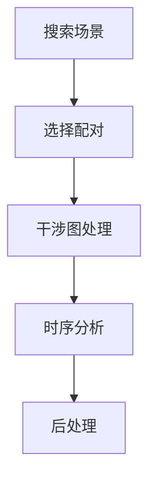

InSARHub 命令行工具（`insarhub`）用一个命令驱动整个流程 —— 搜索、处理、分析。本页展示**端到端工作流**：该运行哪些命令、以何种顺序运行。关于每个子命令和标志的完整说明，请参见 [CLI 参考](../advanced/cli_reference.md)，或对任意命令运行 `--help`。

```bash
insarhub <command> [options]
insarhub --help
insarhub downloader --help
```

## 工作流

<div style="text-align: center;">

</div>

每次运行都是相同的四个阶段 —— **搜索与选择 → 处理 → 分析 → 后处理** —— 区别仅在于由哪个处理器/分析器后端来完成工作。每个命令都会向工作目录写入一个 `insarhub_config.json`，并在后续运行时自动加载它，因此首次调用之后只需传入发生变化的参数。

## HyP3

云端处理 —— 无需本地工具；干涉图由 ASF HyP3 生成。

```bash
# 1. 搜索并选择配对
insarhub downloader -N S1_SLC \
    --AOI -113.05 37.74 -112.68 38.00 \
    --start 2020-01-01 --end 2020-12-31 --stacks 100:466 \
    -w /data/bryce --select-pairs

# 2. 向 HyP3 提交干涉图
insarhub processor submit -w /data/bryce

# 3. 检查作业状态（重复运行直到全部 SUCCEEDED）
insarhub processor refresh -w /data/bryce

# 4. 下载已完成的产品
insarhub processor download -w /data/bryce

# 5. 时序分析
insarhub analyzer -N Hyp3_Mintpy_SBAS -w /data/bryce run

# 6. 将速度场导出为 GeoTIFF
insarhub utils h5-to-raster -i /data/bryce/p100_f466/velocity.h5
```

## ISCE2_S1

需要本地安装 ISCE2（或使用 `--container`）。需先下载 SLC `.SAFE` 文件。

```bash
# 搜索并下载 SLC 场景 + 轨道文件
insarhub downloader -N S1_SLC \
    --AOI -113.05 37.74 -112.68 38.00 \
    --start 2020-01-01 --end 2020-12-31 --stacks 100:466 \
    -w /data/p100_f466 --select-pairs --download -O
```

处理堆叠，然后运行时序分析（可先给 submit 加 `--dry-run` 检查路径）：

=== "本地"

    ```bash
    insarhub processor submit  -N ISCE2_S1 -w /data/p100_f466
    insarhub processor refresh -N ISCE2_S1 -w /data/p100_f466
    insarhub analyzer  -N ISCE2_Mintpy_SBAS -w /data/p100_f466 run
    ```

=== "本地（容器）"

    ```bash
    insarhub processor submit  -N ISCE2_S1 -w /data/p100_f466 --container
    insarhub processor refresh -N ISCE2_S1 -w /data/p100_f466 --container
    insarhub analyzer  -N ISCE2_Mintpy_SBAS -w /data/p100_f466 run --container
    ```

=== "HPC (SLURM)"

    ```bash
    insarhub processor submit  -N ISCE2_S1 -w /data/p100_f466 --hpc_mode
    insarhub processor refresh -N ISCE2_S1 -w /data/p100_f466
    insarhub analyzer  -N ISCE2_Mintpy_SBAS -w /data/p100_f466 run --hpc_mode
    ```

```bash
# 将速度场导出为 GeoTIFF
insarhub utils h5-to-raster -i /data/p100_f466/mintpy/geo/geo_velocity.h5
```

## GMTSAR_S1

需要本地安装 GMTSAR（或使用 `--container`）。需先下载 SLC `.SAFE` 文件；DEM 会根据覆盖范围自动下载。

```bash
# 搜索并下载 SLC 场景 + 轨道文件
insarhub downloader -N S1_SLC \
    --AOI -113.05 37.74 -112.68 38.00 \
    --start 2020-01-01 --end 2020-12-31 --stacks 100:466 \
    -w /data/gmtsar --select-pairs --download -O
```

生成干涉图，然后运行 MintPy 时序：

=== "本地"

    ```bash
    insarhub processor submit  -N GMTSAR_S1 -w /data/gmtsar
    insarhub processor refresh -N GMTSAR_S1 -w /data/gmtsar
    insarhub analyzer  -N GMTSAR_Mintpy_SBAS -w /data/gmtsar run
    ```

=== "本地（容器）"

    ```bash
    insarhub processor submit  -N GMTSAR_S1 -w /data/gmtsar --container
    insarhub processor refresh -N GMTSAR_S1 -w /data/gmtsar --container
    insarhub analyzer  -N GMTSAR_Mintpy_SBAS -w /data/gmtsar run --container
    ```

=== "HPC (SLURM)"

    ```bash
    insarhub processor submit  -N GMTSAR_S1 -w /data/gmtsar --hpc_mode
    insarhub processor refresh -N GMTSAR_S1 -w /data/gmtsar
    insarhub analyzer  -N GMTSAR_Mintpy_SBAS -w /data/gmtsar run --hpc_mode
    ```

```bash
# 将速度场导出为 GeoTIFF（GMTSAR 输出已是地理编码）
insarhub utils h5-to-raster -i /data/gmtsar/gmtsar_mintpy/velocity.h5
```

## ISCE3_Burst + Dolphin

需要 ISCE3 / COMPASS / dolphin 技术栈（或使用 `--container`）。直接产出地理编码的速度场 —— 无需 `h5-to-raster`。

```bash
# 搜索并下载 Sentinel-1 burst（组装为 .SAFE）
insarhub downloader -N S1_Burst \
    --AOI -106.06 40.34 -105.70 40.58 \
    --start 2025-01-08 --end 2025-04-26 \
    -w /data/p56 --select-pairs --download
```

运行 burst 流程（dem、tec、cslc、static、ifg、stitch、unwrap、los），然后运行 Dolphin 时序：

=== "本地"

    ```bash
    insarhub processor submit  -N ISCE3_Burst -w /data/p56
    insarhub processor refresh -N ISCE3_Burst -w /data/p56
    insarhub analyzer  -N ISCE3_Dolphin_PL -w /data/p56 run
    ```

=== "本地（容器）"

    ```bash
    insarhub processor submit  -N ISCE3_Burst -w /data/p56 --container
    insarhub processor refresh -N ISCE3_Burst -w /data/p56 --container
    insarhub analyzer  -N ISCE3_Dolphin_PL -w /data/p56 run --container
    ```

=== "HPC (SLURM)"

    ```bash
    insarhub processor submit  -N ISCE3_Burst -w /data/p56 --hpc_mode
    insarhub processor refresh -N ISCE3_Burst -w /data/p56
    insarhub analyzer  -N ISCE3_Dolphin_PL -w /data/p56 run --hpc_mode
    ```

速度场输出为 `/data/p56/timeseries/velocity.tif`（已是 GeoTIFF —— 无需 `h5-to-raster`）。

## NISAR_GSLC + Dolphin

需要 ISCE3 / dolphin 环境（或使用 `--container`）—— 与 `ISCE3_Burst` 相同的镜像。NISAR GSLC 本身已地理编码，因此无需配准/地理编码：栈直接进入 dolphin。`ISCE3_NISAR` 会先把每个 GSLC 裁剪到 AOI，因此即便源帧极大，小 AOI 也能保持快速、轻量。

```bash
# 搜索并下载 NISAR L2 GSLC 帧（每个日期一帧已地理编码的产品）
insarhub downloader -N NISAR_GSLC \
    --AOI -113.08 37.68 -112.58 38.07 \
    --start 2025-11-01 --end 2026-09-01 \
    -w /data/p77 --download
```

运行 dolphin 流水线（ifg、stitch、unwrap），随后进行 Dolphin 时序分析：

=== "本地"

    ```bash
    insarhub processor submit  -N ISCE3_NISAR -w /data/p77
    insarhub processor refresh -N ISCE3_NISAR -w /data/p77
    insarhub analyzer  -N ISCE3_Dolphin_PL -w /data/p77 run
    ```

=== "本地（容器）"

    ```bash
    insarhub processor submit  -N ISCE3_NISAR -w /data/p77 --container
    insarhub processor refresh -N ISCE3_NISAR -w /data/p77 --container
    insarhub analyzer  -N ISCE3_Dolphin_PL -w /data/p77 run --container
    ```

=== "HPC（SLURM）"

    ```bash
    insarhub processor submit  -N ISCE3_NISAR -w /data/p77 --hpc_mode
    insarhub processor refresh -N ISCE3_NISAR -w /data/p77
    insarhub analyzer  -N ISCE3_Dolphin_PL -w /data/p77 run --hpc_mode
    ```

速度场输出为 `/data/p77/timeseries/velocity.tif`。若要处理整幅已地理编码的帧而非 AOI 窗口，加上 `--process_full_extent`（需要大内存宿主机）。

!!! tip "完整标志"
    关于每个命令的选项，请运行 `insarhub <command> --help` 或参见 [CLI 参考](../advanced/cli_reference.md)。若要在无本地安装的情况下运行任意后端，加上 `--container <镜像>` —— 参见[容器运行](../advanced/container.md)。

*[HPC]: High Performance Computing
*[HyP3]: Hybrid Pluggable Processing Pipeline
*[ASF]: Alaska Satellite Facility
*[AOI]: Area of Interest
*[SLC]: Single Look Complex
*[SBAS]: Small Baseline Subset
