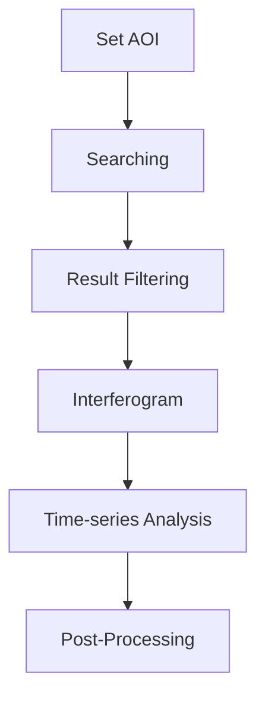

This section provides an overview of the complete InSAR time-series processing workflow using Python API, guiding you through each stage of the analysis pipeline.

 [](https://colab.research.google.com/github/jldz9/InSARHub/blob/tutorial/insarhub_tutorial_v0.2.4.ipynb)


## Modules 
The InSAR script is designed with three config-based main modules to cover the entire InSAR processing workflow:

[Downloader](../advanced/downloader.md){.md-button .md-button--lg} [Processor](../advanced/processor.md){ .md-button .md-button--lg} [Analyzer](../advanced/analyzer.md){ .md-button .md-button--lg}

You can click on each module to view detailed information later. For now, let's begin by running the program using the basic example.
## Workflow

The basic workflow of InSARHub can be briefly described as:
<div style="text-align: center;">

</div>

### Set AOI

InSARHub allows to define the AOI using **bounding box**, **shapefiles**, or **WKT**:

#### Bounding box
```python
AOI = [-113.05, 37.74, -112.68, 38.00]
```
??? Note
    The AOI should be specified as ***[min_long, min_lat, max_long, max_lat]*** under CRS: EPSG:4326 (WGS84)
#### Shapefiles

```python
AOI = 'path/to/your/shapefile.shp'
```
#### WKT
```python
AOI = 'POLYGON((-113.05 37.74, -113.05 38.00, -112.68 38.00, -112.68 37.74, -113.05 37.74))'
```

### Searching
Once the AOI is defined, you can perform searches using the Downloader.

```python
from insarhub import Downloader
AOI = [-113.05, 37.74, -112.68, 38.00]
s1 = Downloader.create('S1_SLC', intersectsWith=AOI)
results = s1.search()
```
??? Output
    ```py
    Searching for SLCs....
    -- A total of 991 results found. 

    The AOI crosses 18 stacks, you can use .summary() or .footprint() to check footprints and .filter(path_frame=(...)) to select the stack of scenes
    you would like to download. If use .download() directly will create subfolders under /home/jldz9/dev/InSARHub for each stack
    ```

### Result Filtering
Your AOI probably spans multiple scenes. To view the search result footprints, you can use:
```python 
s1.footprint()
```
This will display a footprint map of the available Sentinel-1 scenes that covers the AOI. The stack indicates the number of SAR scenes in that footprint. Because we have multiple stacks the graph will be a bit messy:

{: style="width:500px; display: block; margin: auto;" }

Let's check details of our SAR scene stacks and figure out which stack(s) we want to keep:
```python
s1.summary()
```
This will output the summary of available Sentinel-1 scenes that cover the AOI.
??? output
    ```bash
    === ASCENDING ORBITS (14 Stacks) ===
    relativeOrbit 20 frame 117 | Count: 10 | 2015-04-05 --> 2016-11-19
    relativeOrbit 20 frame 118 | Count: 156 | 2016-12-13 --> 2026-02-24
    relativeOrbit 20 frame 119 | Count: 2 | 2015-03-24 --> 2015-12-25
    relativeOrbit 20 frame 120 | Count: 12 | 2014-10-31 --> 2016-09-14
    relativeOrbit 20 frame 121 | Count: 6 | 2015-04-05 --> 2015-08-27
    relativeOrbit 20 frame 122 | Count: 4 | 2016-05-05 --> 2016-11-19
    relativeOrbit 20 frame 123 | Count: 151 | 2016-12-13 --> 2026-02-24
    relativeOrbit 93 frame 116 | Count: 85 | 2014-11-05 --> 2021-12-16
    relativeOrbit 93 frame 117 | Count: 25 | 2015-03-29 --> 2026-03-01
    relativeOrbit 93 frame 118 | Count: 5 | 2016-10-07 --> 2017-01-11
    relativeOrbit 93 frame 119 | Count: 1 | 2017-02-10 --> 2017-02-10
    relativeOrbit 93 frame 120 | Count: 14 | 2015-11-12 --> 2025-07-04
    relativeOrbit 93 frame 121 | Count: 85 | 2014-11-05 --> 2021-12-16
    relativeOrbit 93 frame 122 | Count: 22 | 2025-05-05 --> 2026-03-01

    === DESCENDING ORBITS (4 Stacks) ===
    relativeOrbit 100 frame 464 | Count: 119 | 2015-11-24 --> 2026-02-23
    relativeOrbit 100 frame 465 | Count: 20 | 2014-11-29 --> 2017-01-05
    relativeOrbit 100 frame 466 | Count: 161 | 2017-02-22 --> 2022-07-02
    relativeOrbit 100 frame 469 | Count: 119 | 2015-11-24 --> 2026-02-23
    ```

The program identified 18 potential stacks (14 ascending, 4 descending). We can narrowed the dataset to the descending track Path 100, Frame 466 in year 2020 by:

```python
filter_results = s1.filter(path_frame=(100,466), start='2020-01-01', end='2020-12-31')
```

Check back the footprint and summary:
```python
s1.footprint()
s1.summary()
```
would return: 

{: style="width:500px; display: block; margin: auto;" }
```python
=== DESCENDING ORBITS (1 Stacks) ===
Path 100 Frame 466 | Count: 30 | 2020-01-02 --> 2020-12-27
```

Use `download` to download searched SLC data
```
s1.download()
```

Use `reset` to restore original search results. 
```
s1.reset()
```

### Interferogram

After locating SAR scene stack(s), generate unwrapped interferograms for time-series analysis. InSARHub supports two processing backends — select one below:

=== "Sentinel-1 HyP3"

    Cloud-based processing via [ASF HyP3](https://hyp3-docs.asf.alaska.edu/) — no local ISCE2 required.

    Select interferogram pairs and submit to HyP3:

    ```python
    from insarhub import Processor
    from insarhub.utils import plot_pair_network

    pair_stacks, B, scene_bperp = s1.select_pairs(max_degree=5)
    fig = plot_pair_network(pair_stacks, B, scene_bperp)
    fig.show()
    ```

    If the network looks healthy, submit the pairs:

    {:  margin: auto;" }

    ```python
    for (path, frame), pairs in pair_stacks.items():
        processor = Processor.create('Hyp3_S1', pairs=pairs, workdir=f'your/directory/p{path}_f{frame}')
        processor.submit()
        processor.save()
    ```

    This generates `hyp3_jobs.json` in the work directory. Processing takes ~30 minutes per 100 interferograms.

    To check status and download results:

    ```python
    processor_reload = Processor.create('Hyp3_S1', saved_job_path='your/directory/p100_f466/hyp3_jobs.json')
    processor_reload.refresh()
    processor_reload.download()
    ```

    ??? Output
        ```
        User: jldz9asf (65 jobs)

            JOB NAME                            JOB ID                                 STATUS
        - ifg_20201016T133502_20201109T133501 961b4d1c-df15-4272-843f-390c98f14f50 | SUCCEEDED
        - ifg_20200829T133500_20200910T133501 a449ebf8-1dbc-4a41-a1ae-a6d30deb1fd2 | SUCCEEDED
        ...
        ```

=== "Sentinel-1 ISCE2"

    Local on-premise processing using [ISCE2](https://github.com/isce-framework/isce2) `stackSentinel`. Requires ISCE2 installed (see [Installation](install.md)) and SLC `.SAFE` files downloaded first (`s1.download()`).

    ```python
    from insarhub import Processor
    from insarhub.config import ISCE_S1_Config

    for (path, frame), pairs in pair_stacks.items():
        cfg = ISCE_S1_Config(
            workdir=f'your/directory/p{path}_f{frame}',
            bbox=[37.74, 38.00, -113.05, -112.68],   # [S, N, W, E]
            slc_dir=f'your/directory/p{path}_f{frame}/slc',
        )
        processor = Processor.create('ISCE_S1', pairs=pairs, config=cfg)
        processor.submit()   # starts processing in the background
    ```

    !!! tip "Dry run first"
        Add `dry_run=True` to `ISCE_S1_Config` to preview run scripts without executing.

    Monitor progress and wait for completion:

    ```python
    processor.refresh()                      # prints step table
    processor.watch(refresh_interval=120)    # blocks until all steps finish
    ```

    ??? Output
        ```
          STEP                                          STATUS
        -----------------------------------------------------------------
          - run_01_unpack_topo_reference                SUCCEEDED
          - run_02_unpack_secondary_slc                 RUNNING
              cmd_0000  SUCCEEDED
              cmd_0001  RUNNING
              cmd_0002  PENDING
          - run_03_average_baseline                     PENDING
          ...
        ```

    Once all steps show `SUCCEEDED`, interferograms are in `workdir/isce/merged/interferograms/`.

### Time-series Analysis

After generating interferograms, run MintPy SBAS time-series analysis using the matching analyzer:

=== "Sentinel-1 HyP3"

    ```python
    from insarhub import Analyzer

    workdir = 'your/directory/p100_f466'
    analyzer = Analyzer.create('Hyp3_SBAS', workdir=workdir)
    analyzer.prep_data()
    analyzer.run()
    ```

=== "Sentinel-1 ISCE2"

    ```python
    from insarhub import Analyzer

    workdir = 'your/directory/p100_f466'
    analyzer = Analyzer.create('ISCE_SBAS', workdir=workdir)
    analyzer.prep_data()   # auto-discovers ISCE2 outputs, writes mintpy/.mintpy.cfg
    analyzer.run()         # all MintPy outputs written to workdir/mintpy/
    ```

*[AOI]: Area of interest
*[ASF]: Alaska Satellite Facility
*[WKT]: Well-known text representation of geometry
*[CRS]: Coordinate Reference System
*[SLC]: Single Look Complex
*[SBAS]: Small Baseline Subset