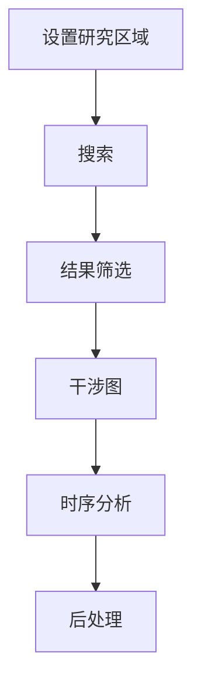

本节介绍使用 Python API 进行完整 InSAR 时序处理流程的概述，引导您完成分析流程的每个阶段。

 [](https://colab.research.google.com/github/jldz9/InSARHub/blob/tutorial/insarhub_tutorial_v0.2.4.ipynb)


## 模块
InSAR 脚本设计了三个基于配置的主要模块，覆盖完整的 InSAR 处理流程：

[下载器](../advanced/downloader.md){.md-button .md-button--lg} [处理器](../advanced/processor.md){ .md-button .md-button--lg} [分析器](../advanced/analyzer.md){ .md-button .md-button--lg}

点击各模块可查看详细信息。现在，让我们从基本示例开始运行程序。

## 工作流程

InSARHub 的基本工作流程可简要描述如下：

<div style="text-align: center;">

</div>

### 设置研究区域

InSARHub 支持使用**边界框**、**Shapefile** 或 **WKT** 定义研究区域（AOI）：

#### 边界框
```python
AOI = [-113.05, 37.74, -112.68, 38.00]
```
??? 注意
    AOI 应在 CRS: EPSG:4326 (WGS84) 下指定为 ***[最小经度, 最小纬度, 最大经度, 最大纬度]***

#### Shapefile

```python
AOI = 'path/to/your/shapefile.shp'
```

#### WKT
```python
AOI = 'POLYGON((-113.05 37.74, -113.05 38.00, -112.68 38.00, -112.68 37.74, -113.05 37.74))'
```

### 搜索
定义 AOI 后，可使用 Downloader 进行搜索。

```python
from insarhub import Downloader
AOI = [-113.05, 37.74, -112.68, 38.00]
s1 = Downloader.create('S1_SLC', intersectsWith=AOI)
results = s1.search()
```
??? 输出
    ```py
    Searching for SLCs....
    -- A total of 991 results found. 

    The AOI crosses 18 stacks, you can use .summary() or .footprint() to check footprints and .filter(path_frame=(...)) to select the stack of scenes
    you would like to download. If use .download() directly will create subfolders under /home/jldz9/dev/InSARHub for each stack
    ```

### 结果筛选
AOI 可能跨越多个场景。使用以下命令查看搜索结果的覆盖范围：
```python 
s1.footprint()
```
这将显示覆盖 AOI 的 Sentinel-1 场景覆盖图。由于存在多个堆叠，图像可能较为复杂：

{: style="width:500px; display: block; margin: auto;" }

查看 SAR 场景堆叠的详细信息：
```python
s1.summary()
```
??? 输出
    ```bash
    === ASCENDING ORBITS (14 Stacks) ===
    relativeOrbit 20 frame 117 | Count: 10 | 2015-04-05 --> 2016-11-19
    relativeOrbit 20 frame 118 | Count: 156 | 2016-12-13 --> 2026-02-24
    ...

    === DESCENDING ORBITS (4 Stacks) ===
    relativeOrbit 100 frame 464 | Count: 119 | 2015-11-24 --> 2026-02-23
    relativeOrbit 100 frame 466 | Count: 161 | 2017-02-22 --> 2022-07-02
    ...
    ```

程序识别出 18 个潜在堆叠。筛选至 2020 年降轨轨道 Path 100、Frame 466：

```python
filter_results = s1.filter(path_frame=(100,466), start='2020-01-01', end='2020-12-31')
```

使用 `download` 下载搜索到的 SLC 数据：
```
s1.download()
```

使用 `reset` 恢复原始搜索结果：
```
s1.reset()
```

### 干涉图

定位 SAR 场景堆叠后，下一步是生成解缠干涉图以准备时序分析。选择处理后端：

=== "Sentinel-1 HyP3"

    基于云端的处理，通过 [ASF HyP3](https://hyp3-docs.asf.alaska.edu/) 进行，无需本地安装 ISCE2。

    选择干涉图配对并提交至 HyP3：

    ```python
    from insarhub import Processor
    from insarhub.utils import plot_pair_network

    pair_stacks, B, scene_bperp, _ = s1.select_pairs(max_degree=5)
    fig = plot_pair_network(pair_stacks, B, scene_bperp)
    fig.show()
    ```

    若网络连通性良好，提交配对：

    {:  margin: auto;" }

    ```python
    for (path, frame), pairs in pair_stacks.items():
        processor = Processor.create('Hyp3_S1', pairs=pairs, workdir=f'your/directory/p{path}_f{frame}')
        processor.submit()
        processor.save()
    ```

    在工作目录中生成 `hyp3_jobs.json`。每 100 个干涉图处理约需 30 分钟。

    查看状态并下载结果：

    ```python
    processor_reload = Processor.create('Hyp3_S1', saved_job_path='your/directory/p100_f466/hyp3_jobs.json')
    processor_reload.refresh()
    processor_reload.download()
    ```

    ??? 输出
        ```
        User: jldz9asf (65 jobs)

            JOB NAME                            JOB ID                                 STATUS
        - ifg_20201016T133502_20201109T133501 961b4d1c-df15-4272-843f-390c98f14f50 | SUCCEEDED
        - ifg_20200829T133500_20200910T133501 a449ebf8-1dbc-4a41-a1ae-a6d30deb1fd2 | SUCCEEDED
        ...
        ```

=== "Sentinel-1 ISCE2"

    使用 [ISCE2](https://github.com/isce-framework/isce2) `stackSentinel` 进行本地处理。需先安装 ISCE2（见[安装说明](install.md)）并下载 SLC `.SAFE` 文件（使用 `s1.download()`）。

    ```python
    from insarhub import Processor
    from insarhub.config import ISCE_S1_Config

    for (path, frame), pairs in pair_stacks.items():
        cfg = ISCE_S1_Config(
            workdir=f'your/directory/p{path}_f{frame}',
            bbox=[37.74, 38.00, -113.05, -112.68],   # [南, 北, 西, 东]
            slc_dir=f'your/directory/p{path}_f{frame}/slc',
        )
        processor = Processor.create('ISCE_S1', pairs=pairs, config=cfg)
        processor.submit()   # 在后台启动处理
    ```

    !!! tip "建议先进行试运行"
        在 `ISCE_S1_Config` 中添加 `dry_run=True` 可预览运行脚本和路径检查，而不执行任何操作。

    监控步骤进度并等待完成：

    ```python
    processor.refresh()                      # 打印步骤状态表
    processor.watch(refresh_interval=120)    # 阻塞直到所有步骤完成
    ```

    ??? 输出
        ```
          STEP                                          STATUS
        -----------------------------------------------------------------
          - run_01_unpack_topo_reference                SUCCEEDED
          - run_02_unpack_secondary_slc                 RUNNING
              cmd_0000  SUCCEEDED
              cmd_0001  RUNNING
              cmd_0002  PENDING
          - run_03_average_baseline                     PENDING
          ...
        ```

    所有步骤显示 `SUCCEEDED` 后，干涉图位于 `workdir/isce/merged/interferograms/`。

### 时序分析

生成干涉图后，使用对应的分析器运行 MintPy SBAS 时序分析：

=== "Sentinel-1 HyP3"

    ```python
    from insarhub import Analyzer

    workdir = 'your/directory/p100_f466'
    analyzer = Analyzer.create('Hyp3_SBAS', workdir=workdir)
    analyzer.prep_data()
    analyzer.run()
    ```

=== "Sentinel-1 ISCE2"

    ```python
    from insarhub import Analyzer

    workdir = 'your/directory/p100_f466'
    analyzer = Analyzer.create('ISCE_SBAS', workdir=workdir)
    analyzer.prep_data()   # 自动发现 ISCE2 输出，写入 mintpy/.mintpy.cfg
    analyzer.run()         # 所有 MintPy 输出写入 workdir/mintpy/
    ```

### 后处理
通常由 MintPy 等分析器自动处理后处理步骤。


*[AOI]: 研究区域
*[ASF]: Alaska Satellite Facility
*[WKT]: 几何图形的文本表示
*[CRS]: 坐标参考系统
*[SLC]: 单视复数
*[SBAS]: 小基线集
